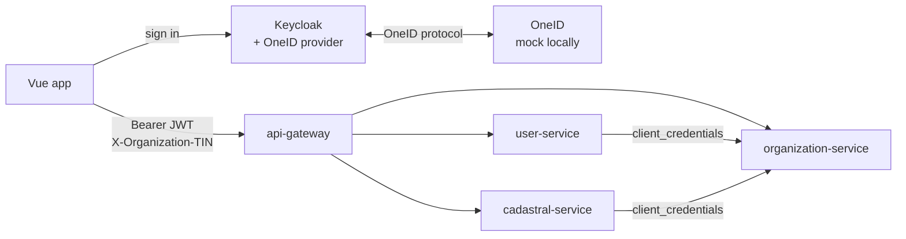

# OneID Platform

A production-oriented learning project: **OneID → Keycloak → Spring Boot microservices → Vue 3**,
with role-based access control, database-backed permissions, organization (TIN) context, and
OAuth2 service-to-service authentication. It runs entirely on a laptop, with a mock of OneID that
speaks the real wire protocol.

The rule the whole design follows:

> **Microservices never talk to OneID.** Only Keycloak does, and only at login and logout.
> Every service trusts exactly one token issuer: Keycloak, and checks every token itself.



---

## Quick start

You need **Docker Desktop**, **JDK 21** and **Maven 3.9+**. Node.js 20+ is needed only to run the
frontend's tests or its dev server; the image builds the frontend itself.

```bash
cp .env.example .env
```

```bash
mvn -DskipTests package
```

```bash
docker compose up -d --build
```

The first start takes a minute or two while Keycloak imports the realm. Then open
**http://localhost:5174**, press **Login**, choose **OneID**, pick `akarimov` on the mock's page, and
press **Load session**.

To stop, keeping all data:

```bash
docker compose down
```

To start over from an empty database, realm included:

```bash
docker compose down -v
```

After changing Java code, run `mvn -DskipTests package` again before `docker compose up -d --build`:
the images are built from the jars Maven produces. To run one service from your IDE instead, see
[configuration](docs/configuration.md#two-ways-to-run).

---

## Signing in

**Through OneID**, on the mock's identity picker. These people exist only in the mock:

| Login | Shows |
|---|---|
| `akarimov` | a person with two organizations, 111111111 and 222222222: switch between them |
| `myusupova` | a person with no organization |
| `bbankov` | a sign-in with a legal entity's e-signature, organization 333333333 |
| `ntasdiqlanmagan` | an unconfirmed OneID account, which still signs in |
| `broken` | OneID refusing to identify the person: the login fails with a generic message |
| `nopin` | OneID sending no PIN: the login fails, because there is nothing stable to link on |

**With a password**, as development users with business roles already granted. The password is
`password` for all of them:

| Username | Realm roles | Organizations |
|---|---|---|
| `ali` | `JISMONIY_SHAXS`, `YURIDIK_SHAXS`, `QURUVCHI` | 111111111, 222222222 |
| `bank_user` | `JISMONIY_SHAXS`, `BANK` | 333333333 |
| `dual` | `JISMONIY_SHAXS`, `QURUVCHI`, `BANK` | 111111111 |
| `admin_user` | `JISMONIY_SHAXS`, `ADMIN` | none |
| `super_admin` | `JISMONIY_SHAXS`, `SUPER_ADMIN` | none |
| `malika` | `JISMONIY_SHAXS` | none |
| `unverified` | `JISMONIY_SHAXS` | none, `identity_verified=false` |

`SUPER_ADMIN` is deliberately **not** a superset of `ADMIN`: each can do something the other cannot.

The Keycloak admin console is at http://localhost:8190, with the credentials from `.env`.

**Things worth trying in the app:**
- Sign in as `dual`, and create a project and then a payment: two roles, one token.
- Sign in as `bank_user` and press **Create project**: a real 403 from the server. The button is
  never hidden, because hiding it is not the control.
- As `ali`, type `444444444` into the organization box: 403, because the header is checked against
  membership.
- Sign in in two tabs and log out in one: the other tab signs out too.

---

## What runs where

| Component | URL | |
|---|---|---|
| Vue app | http://localhost:5174 | nginx serving the built app |
| Keycloak | http://localhost:8190 | realm `platform` |
| mock OneID | http://localhost:8191 | local stand-in for sso.egov.uz |
| api-gateway | http://localhost:8090 | the only public API entry |
| user-service | http://localhost:8091 | published for learning and tests |
| organization-service | http://localhost:8092 | published for learning and tests |
| cadastral-service | http://localhost:8093 | published for learning and tests |
| PostgreSQL | localhost:5452 | one schema per service |

Every port is deliberately off its default, because clashes on 5432 and 8080 produce failures that
are very hard to read. In production only the gateway and Keycloak would be reachable.

---

## Tests

| What | Command |
|---|---|
| Unit, slice and Testcontainers tests | `mvn test` |
| Frontend | `npm --prefix frontend test` |
| All 26 scenarios against the running stack | `mvn -pl e2e-tests -Pe2e test` |

Each scenario and the tests that prove it are listed in [testing](docs/testing.md).

---

## Documentation

| Document | Covers |
|---|---|
| [Architecture](docs/architecture.md) | components, security boundaries, project structure, trade-offs, limitations, open questions |
| [Flows](docs/flows.md) | OneID login through Keycloak, the JWT, a human request, service-to-service calls, logout |
| [Authorization](docs/authorization.md) | the decision chain, roles, permissions, machine identities, organizations, the data model |
| [Security](docs/security.md) | each security principle, where it is enforced and what proves it; the production checklist |
| [Configuration](docs/configuration.md) | ways to run, every environment variable, the realm settings |
| [API examples](docs/api-examples.md) | every endpoint, called for real, with its responses |
| [Testing](docs/testing.md) | the scenario map, how the tests are built, results |
| [Implementation journal](docs/implementation-journal.md) | how it was built, phase by phase, and what each phase found |

---

## Project structure

```
.
├── docker-compose.yml             the whole application
├── .env.example                   every setting and secret, as local placeholders
├── pom.xml                        Maven aggregator
├── docker/                        one Dockerfile for every Spring Boot module
├── postgres/init/                 schemas and login roles
├── keycloak/                      realm export and the image with the OneID provider
├── oneid-identity-provider/       Keycloak SPI for OneID
├── mock-oneid/                    OneID's protocol with fixture identities, local only
├── platform-security/             the security decisions every service shares
├── api-gateway/                   Spring Cloud Gateway
├── user-service/                  profiles and session bootstrap
├── organization-service/          organizations and memberships
├── cadastral-service/             projects and payments, scoped by organization
├── frontend/                      Vue 3 and keycloak-js
├── e2e-tests/                     the scenarios against the running platform
└── docs/
```

---

## Status

All thirteen phases are complete.

| Phase | Scope |
|---|---|
| 1–2 | Structure, PostgreSQL, Keycloak, realm |
| 3 | Resource servers and Flyway |
| 4 | JWT role converter and caller type |
| 5 | Permissions |
| 6 | Organizations and TIN context |
| 7 | Service-to-service hardening |
| 8 | Gateway and Vue |
| 9 | OneID provider SPI |
| 10 | Mock OneID |
| 11 | Logout |
| 12 | Integration tests |
| 13 | Documentation, and the whole stack in Docker Compose |

**Not done, on purpose:**
- Synchronising a logout made at OneID: no mechanism is documented.
- Redeeming OneID's refresh token: no grant is documented.
- Cutting off an access token already issued at the moment of logout.

The reasons, and the questions for the OneID operator, are in
[architecture](docs/architecture.md#known-limitations).
