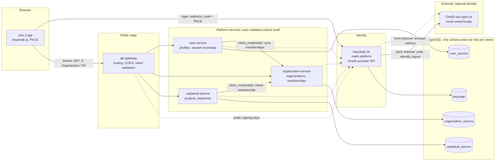

# Architecture

## In one paragraph

A person signs in with **OneID**, Uzbekistan's national identity system. **Keycloak** brokers that
login through a custom identity provider, then issues the platform's own tokens. The **Vue** app
calls the **gateway** with a Keycloak access token, and every **service** behind it validates that
token again on its own. Realm **roles** travel in the token. Fine-grained **permissions** live in
each service's database. The organization a person acts for travels as an `X-Organization-TIN`
header and is **checked against the membership table on every request**. Services call each other
as themselves, with **OAuth2 client credentials**, never with a person's token.

Eight rules govern the design:

1. **Microservices never talk to OneID.** Only Keycloak does, and only at login and logout.
2. **Keycloak is the only token issuer anyone trusts.** A OneID token never leaves Keycloak.
3. **Every service validates tokens itself.** It checks signature, issuer, expiry and audience.
   Passing the gateway proves nothing to a service.
4. **Roles are coarse and live in the token. Permissions are fine-grained and live in the
   service that enforces them.**
5. **An organization is request context, never identity.** The header is a claim to verify, not a
   fact.
6. **A service is not a person.** Service accounts have their own least-privilege roles, and no
   service account is `SUPER_ADMIN`.
7. **OneID is not OpenID Connect.** It is integrated as what it is, not forced into a shape it
   does not have.
8. **What is not documented is not invented.** Refresh-token redemption and logout synchronisation
   stay open questions.

---

## Components



| Component | Port | Responsibility | Trusts | Stores |
|---|---|---|---|---|
| **Vue app** (`frontend`) | 5174 | Sign-in redirect, organization switcher, API calls | Keycloak for tokens | Tokens in memory only |
| **Keycloak** | 8190 | Brokers OneID, issues tokens, holds roles and sessions | OneID, for identity at login | Users, roles, sessions, the PIN |
| **OneID provider** (`oneid-identity-provider`) | inside Keycloak | Speaks OneID's protocol, maps its data, grants baseline roles | OneID | Nothing of its own |
| **mock-oneid** | 8191 | Local stand-in for sso.egov.uz, same wire protocol | Its own client registration | Codes and tokens in memory |
| **api-gateway** | 8090 | The only public API entry: routing, CORS, first token check | Keycloak | Nothing |
| **user-service** | 8091 | Local profiles; the session bootstrap that reconciles memberships | Keycloak | `user_service` schema |
| **organization-service** | 8092 | Organizations, memberships, the membership check | Keycloak | `organization_service` schema |
| **cadastral-service** | 8093 | Construction projects and payments, scoped by organization | Keycloak; organization-service for membership | `cadastral_service` schema |
| **platform-security** | library | The security decisions every service shares | — | — |
| **PostgreSQL** | 5452 | One database, one schema and one login role per owner | — | Everything above |

---

## Security boundaries

Each arrow in the diagram crosses a boundary, and each boundary checks something specific.

| Boundary | What is checked | Where |
|---|---|---|
| Browser → Keycloak | Public client, so no secret. PKCE S256 on the code. Redirect and post-logout URIs matched against `http://localhost:5174/*`. | realm `platform-web` client |
| Keycloak ↔ OneID | Client id and secret in the form body of every back-channel call. `state` generated and verified by Keycloak. Single-use code. `ret_cd` must be `"0"` and a PIN must be present. | `OneIdIdentityProvider` |
| Browser → gateway | CORS allows only the app's origin and the headers `Authorization`, `Content-Type` and `X-Organization-TIN`. The token needs a valid signature, issuer and expiry, and audience `platform-api`. `/internal/**` has no route. | `api-gateway` `SecurityConfig`, `application.yml` |
| Gateway → service | The service validates the token again, against its own audience list. A request that bypasses the gateway gains nothing. | `ResourceServerSecurity` in every service |
| Caller type | `/internal/**` requires `token_use=service`. A person's token is refused there whatever its roles, `SUPER_ADMIN` included. | `ResourceServerSecurity` |
| Organization context | The `X-Organization-TIN` header is checked against active memberships before any controller runs. It is 403 when the caller is not a member, and 400 when an endpoint needs the header and it is missing. | `OrganizationContextFilter` |
| Permission | `@PreAuthorize` on each endpoint names one permission. The permission comes from the service's own table, never from the token. | controllers, `PermissionCatalog` |
| Data | Queries are scoped by the verified organization, so another organization's records are not found. | cadastral-service controllers |
| Service → database | Each service logs in as a role that owns its schema and has no privilege on any other. | `postgres/init/01-schemas.sql` |

The order matters and is deliberate: **authenticate, then caller type, then organization, then
permission, then data**. An anonymous request carrying a TIN is refused as unauthenticated (401),
never judged on membership. See [authorization](authorization.md) for the whole decision chain.

---

## Project structure

```
.
├── docker-compose.yml             the whole application, locally
├── .env.example                   every setting and secret, as local placeholders
├── pom.xml                        Maven aggregator; imports the Spring Boot and Spring Cloud BOMs
├── docker/
│   └── spring-boot-app.Dockerfile one image recipe for all Spring Boot modules
├── postgres/init/01-schemas.sql   five schemas, five login roles, no cross-schema grants
├── keycloak/
│   ├── Dockerfile                 Keycloak with the OneID provider built in
│   └── import/realm-export.json   realm, roles, clients, identity provider, dev users
├── oneid-identity-provider/       Keycloak SPI: OneID protocol, attribute and role mapper
├── mock-oneid/                    OneID's wire protocol with fixture identities, local only
├── platform-security/             shared: token validation, roles, permissions, organization filter
├── api-gateway/                   Spring Cloud Gateway Server MVC
├── user-service/                  profiles, session bootstrap, admin endpoints
├── organization-service/          organizations, memberships, /internal API for services
├── cadastral-service/             projects and payments, scoped by organization
├── frontend/                      Vue 3, Vite, keycloak-js; nginx image
├── e2e-tests/                     the 26 scenarios against the running platform
└── docs/                          this documentation
```

`platform-security` is the only shared module, and it holds security decisions and nothing else:
no entities, no controllers, no business logic. Copying a security converter into four services
guarantees the copies drift, and a security fix would need four changes. A shared library that
started holding business code would quietly turn the services into a distributed monolith.

---

## Decisions and trade-offs

**OneID is integrated as a Keycloak provider, not as a bridge service.** OneID renames OAuth2's
constants (`one_code`, `one_authorization_code`), fetches user data through a third grant type,
and returns no `id_token`, so Keycloak's built-in OIDC provider cannot be configured into its
shape. The alternative, a service that speaks OneID on one side and OpenID Connect on the other,
means writing an OpenID Provider: token signing, key rotation, discovery, nonces. The provider
overrides three protocol methods and inherits the rest. *Cost:* it compiles against Keycloak's
internal SPI, so a major Keycloak upgrade is a recompile and a test pass, not a version bump.

**The OneID access token stops at Keycloak.** It is opaque, long-lived, and can only be validated
by calling OneID, which allows 300 requests a minute for the whole client system. Services receive
Keycloak's JWT, which they verify offline. By default the OneID token is not kept at all. It is
kept only when OneID logout is switched on, because `one_log_out` needs it.

**The PIN is the broker key, and it never leaves Keycloak.** It is the only field in OneID's
response that is stable for life. It is stored as a Keycloak attribute and is in no token, no
service table and no log.

**Roles in the token, permissions in the database.** A token is fixed for its lifetime and seen by
every service. So it carries only what is true everywhere: coarse business roles such as `QURUVCHI`
or `BANK`. What a role may do is decided by the service that enforces it, in its own
`role_permissions` table. *Cost:* a change takes effect at the next catalog refresh, every
5 minutes by default, rather than instantly.

**The organization is a header checked per request, not a claim and not a token per organization.**
One person can act for several organizations and switch between them without signing in again.
Putting the acting organization in the token would force a new login per switch; trusting a
client-chosen claim would make it forgeable. *Cost:* every organization-scoped request needs a
membership answer. organization-service answers from its own table, and cadastral-service asks over
HTTP and caches the answer per person for 60 seconds.

**Tokens are validated offline.** Services never call Keycloak per request, so Keycloak's
availability and latency stay off every request's path. *Cost:* logout cannot recall an access
token already issued. It stays usable until it expires, which is at most 5 minutes plus 60 seconds
of clock skew; the measurement is in the [journal](implementation-journal.md). The ways to close
that window, and why none is used yet, are in [flows](flows.md#logout).

**The gateway validates tokens, and so does every service.** This duplicates work on purpose. A
misrouted request, a debugging shortcut or a future second entry point must not become a way in.

**One PostgreSQL, one schema per owner.** Isolation comes from database privileges rather than
separate servers: a cross-schema query fails in the database, not in code review. *Cost:* the
services share one server's availability and capacity, acceptable locally and replaceable later
without code changes.

**Memberships are reconciled at session bootstrap.** When the app calls `GET /api/users/me`,
user-service sends the TINs from the token's `org_tins` claim to organization-service, which adds,
reactivates and deactivates OneID-sourced memberships. *Cost:* a legal entity OneID stops reporting
is removed at the person's next bootstrap, not the moment OneID changes.

**The mock is a service, not a class.** The Keycloak provider is identical locally and in
production; only its URLs change. So the redirect, the form posts, the JSON parsing and the failure
handling tested locally are the ones that will run against sso.egov.uz.

---

## Failure handling

The platform avoids retries and circuit breakers it does not yet need, and fails closed where
authorization depends on an answer.

| Dependency fails | What happens | Why |
|---|---|---|
| OneID, during login | Keycloak shows a generic login error; the cause is logged | A login screen is no place for endpoint detail |
| OneID code exchange | No retry | A code is single use, so a retry can only fail and looks like an attack |
| OneID, during `one_log_out` | Logged; the Keycloak session still ends | Refusing to log someone out because a third party is down is the worse failure |
| Keycloak, while services run | Existing tokens keep working until they expire; new logins fail | Offline validation |
| organization-service, for a membership check | 403, not cached, asked again on the next request | Fail closed: no answer is not a yes |
| organization-service, during session bootstrap | `/api/users/me` returns no active organizations; logged | Nothing is granted on the strength of a failed sync |
| Database, at permission refresh | The last good mapping is kept; logged | Locking every user out is worse than a mapping at most one refresh old |

Service-to-service calls time out after 5 seconds. For production, add metrics (Actuator exposes
health already), log aggregation, and explicit timeouts on Keycloak's outgoing HTTP client
(`spi-connections-http-client-default-*`) for the calls to OneID.

---

## Known limitations

- **Local only, as configured.** HTTP everywhere, Keycloak in `start-dev`, realm `sslRequired`
  set to `none`, development users with the password `password`, direct access grants enabled on
  `platform-web` for scripted tests, every service port published, and security logging at DEBUG.
  [security](security.md#production-checklist) lists what production changes.
- **A copied access token outlives logout** by up to its lifetime plus clock skew.
- **Permission changes** take up to one refresh interval (5 minutes) to apply. **Membership changes**
  take up to 60 seconds to apply in cadastral-service.
- **`identity_verified` is carried but not yet enforced.** It reaches the token and the user
  profile, but no endpoint refuses an unconfirmed OneID account yet. The intended use is refusing
  high-value operations rather than refusing the person.
- **Deleting a profile** in user-service removes the local profile only. The Keycloak user remains,
  and the next session bootstrap recreates the profile.
- **Audit logging is minimal.** Refused organization contexts and OneID identity acceptance are
  logged; Keycloak's event store is not enabled.
- **The development database role passwords** are literals in `postgres/init/01-schemas.sql` and,
  for Keycloak, in `docker-compose.yml`.

## Open questions for the OneID operator

Carried as open questions rather than guessed at:

1. **How is OneID's `refresh_token` redeemed?** The token response contains one; no grant type is
   documented for it. The provider ignores it. It is a different object from Keycloak's refresh
   token, and conflating the two is the mistake this note exists to prevent.
2. **Does `one_log_out` end the whole session at sso.egov.uz, or only revoke that token?**
3. **How does OneID report errors?** The mock's choices are guesses: HTTP 400 with
   `{"ret_cd":"1","error":"invalid_grant"}` for a refused exchange, and HTTP 200 with
   `{"ret_cd":"1"}` for a refused identify.
4. **Is there a way to learn that a person logged out at OneID?** None is documented, so none is
   implemented.
5. **Is there a test environment?** The specification forbids `localhost` in `redirect_uri`, so a
   first real integration needs a resolvable HTTPS hostname registered with the operator.
6. **Which of `tin` and `le_tin` in `legal_info` is authoritative?** Both appear in the specification.
   The provider prefers `tin` and falls back to `le_tin`.
7. **What is `birth_date`'s format?** The specification's examples contradict each other. The field
   is received and not stored.
