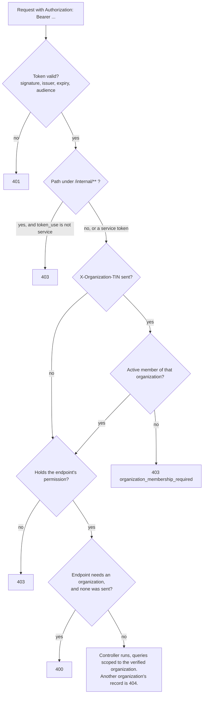
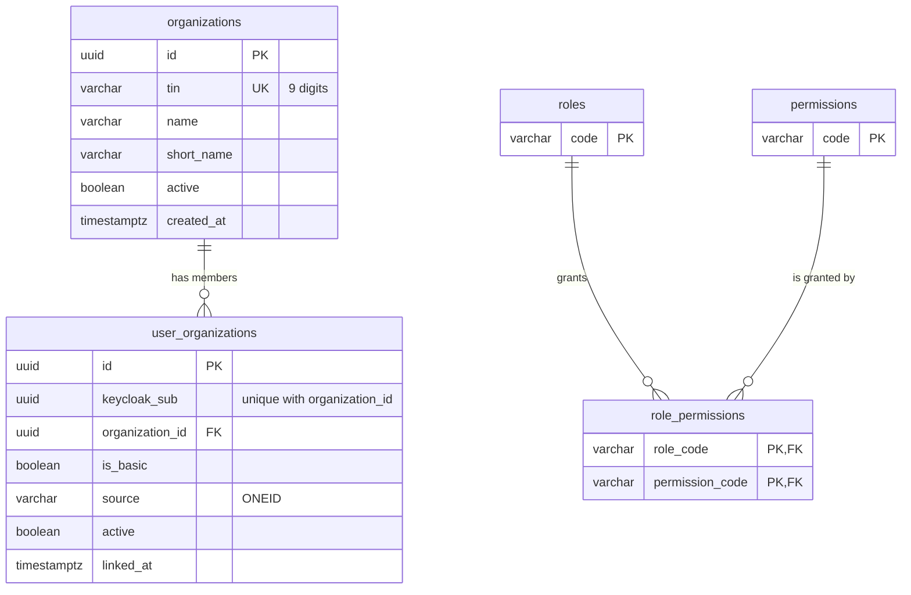
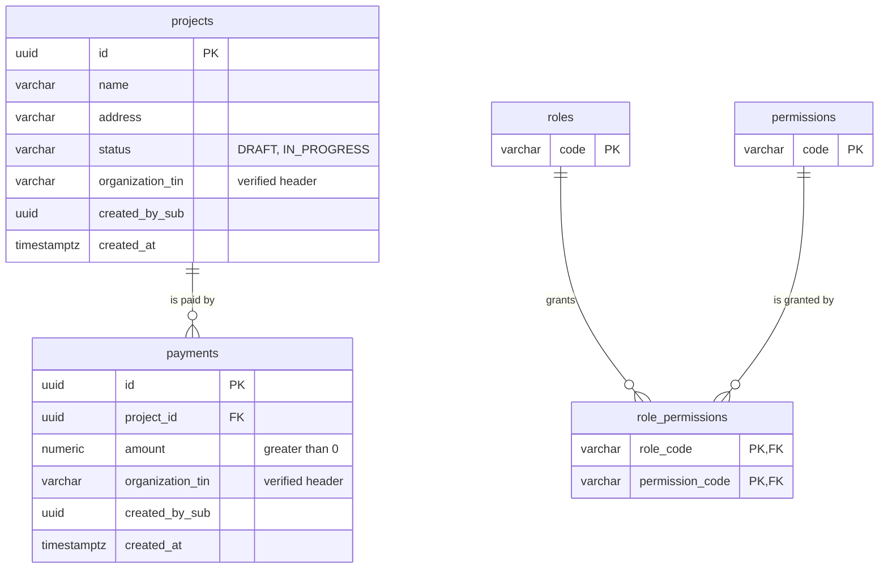

# Authorization

Who may do what, for which organization, and where each part of that is decided.

## The decision chain

Every request to a service passes the same checks in the same order. Each one can only refuse,
never grant something a later check would deny.



| Step | Enforced by | Answer when refused |
|---|---|---|
| Token | Spring Security resource server, configured in each service's `application.yml` | 401 |
| Caller type | `ResourceServerSecurity`: `/internal/**` requires `TOKEN_USE_SERVICE` | 403 |
| Organization | `OrganizationContextFilter`, placed after URL authorization | 403, `{"error":"organization_membership_required"}` |
| Permission | `@PreAuthorize` on the controller method | 403 |
| Organization required | `OrganizationContext.requireTin()` in the controller | 400 |
| Data | repository queries by organization TIN | 404 |

Two consequences of the order are worth knowing. A request with **no token** but a TIN is 401,
never a membership decision. A caller **without the permission** gets 403 even when they also
forgot the organization header, because the permission is checked first.

---

## From token to authorities

`KeycloakAuthoritiesConverter` in platform-security turns a validated token into Spring Security
authorities. Nothing else in the token grants anything.

| From | Becomes | Example |
|---|---|---|
| `realm_access.roles` | `ROLE_` + role | `ROLE_QURUVCHI` |
| each realm role, looked up in this service's `role_permissions` | the permission code | `PROJECT_CREATE` |
| `resource_access.<this service>.roles` | the client role, unprefixed | `ORG_READ`, in organization-service only |
| `scope` | `SCOPE_` + scope | `SCOPE_profile` |
| `token_use` | `TOKEN_USE_USER`, `TOKEN_USE_SERVICE` or `TOKEN_USE_UNKNOWN` | `TOKEN_USE_USER` |

Three properties follow:

- **A permission cannot be put in a token.** Permissions are looked up by role in the service's own
  database. A `permissions` or `authorities` claim is ignored, and a scope named `PROJECT_CREATE`
  becomes `SCOPE_PROJECT_CREATE`, which nothing checks.
- **A client role counts only in its own service.** cadastral-service's `ORG_READ` means something
  to organization-service and nothing to cadastral-service itself.
- **The caller type comes from a claim Keycloak adds per client.** Only the values `user` and
  `service` count. Anything else, including a missing claim, is `UNKNOWN`.

The principal name is `preferred_username`, falling back to `azp` for service tokens and then to `sub`.

---

## Roles

Realm roles are coarse, business-level and the same in every service.

| Role | Meaning | Granted by |
|---|---|---|
| `JISMONIY_SHAXS` | A physical person. Every OneID account. | the OneID mapper, on every login |
| `YURIDIK_SHAXS` | Acts on behalf of a legal entity | the OneID mapper, when OneID reports legal entities or a legal-entity sign-in |
| `QURUVCHI` | Builder: registers and updates construction projects | an administrator |
| `BANK` | Bank operator: records payments | an administrator |
| `ADMIN` | Manages user accounts | an administrator |
| `SUPER_ADMIN` | Platform administration. **Not** a superset of `ADMIN`. | an administrator |

OneID can assert that someone is a person, and that they represent a company. It cannot assert that
someone is a builder or a bank operator, so those roles are business decisions made in Keycloak.

The mapper **grants and never revokes**. If OneID stops reporting a legal entity, `YURIDIK_SHAXS`
stays, because the mapper cannot tell whether an administrator granted it deliberately. Acting for
the vanished organization is still refused, by the membership table, which is where that decision
belongs.

---

## Permissions

Each service owns three tables in its own schema: `roles`, `permissions` and `role_permissions`.
`PermissionCatalog` loads the mapping at startup and again every 5 minutes
(`platform.security.permission-refresh-ms`). A request therefore never waits on the database for
authorization.

- A person's effective permissions are the **union** over their roles. There is no precedence, and
  no special case for anyone holding several roles.
- A role with no rows in a service grants nothing there.
- If a refresh fails, the previous mapping stays in force.

### What each role may do

**cadastral-service**

| Role | `PROJECT_READ` | `PROJECT_CREATE` | `PROJECT_UPDATE` | `PAYMENT_READ` | `PAYMENT_CREATE` |
|---|:-:|:-:|:-:|:-:|:-:|
| `JISMONIY_SHAXS` | ✓ | | | | |
| `YURIDIK_SHAXS` | ✓ | | | | |
| `QURUVCHI` | ✓ | ✓ | ✓ | | |
| `BANK` | | | | ✓ | ✓ |

**organization-service**

| Role | `ORGANIZATION_READ` | `ORGANIZATION_UPDATE` |
|---|:-:|:-:|
| `YURIDIK_SHAXS` | ✓ | |
| `ADMIN` | ✓ | |
| `SUPER_ADMIN` | ✓ | ✓ |

**user-service**

| Role | `USER_READ` | `USER_UPDATE` | `USER_DELETE` | `PLATFORM_ADMIN` |
|---|:-:|:-:|:-:|:-:|
| `ADMIN` | ✓ | ✓ | ✓ | |
| `SUPER_ADMIN` | ✓ | ✓ | | ✓ |

`SUPER_ADMIN` holds `PLATFORM_ADMIN`, which no other role has, and lacks `USER_DELETE`, which
`ADMIN` has. Neither role contains the other, so no role is quietly a wildcard.

Some permissions are defined but granted to no role and used by no endpoint yet: `PROJECT_DELETE`,
`PAYMENT_UPDATE`, `PAYMENT_DELETE`, `ORGANIZATION_CREATE`, `ORGANIZATION_DELETE` and `USER_CREATE`.

### Changing a permission

A permission change is a row change in the service that enforces it, for example:

```sql
INSERT INTO cadastral_service.role_permissions (role_code, permission_code) VALUES ('BANK', 'PROJECT_READ');
```

It takes effect at that service's next catalog refresh, within 5 minutes. No token needs to change
and nobody needs to sign in again.

### Endpoints

| Method and path | Service | Requires |
|---|---|---|
| `GET /api/public/hello` | user-service | nothing |
| `GET /api/users/me` | user-service | a person's token |
| `GET /api/users/me/claims` | user-service | a person's token |
| `GET /api/admin/users` | user-service | `USER_READ` |
| `PUT /api/admin/users/{id}` | user-service | `USER_UPDATE` |
| `DELETE /api/admin/users/{id}` | user-service | `USER_DELETE` |
| `GET /api/platform/audit` | user-service | `PLATFORM_ADMIN` |
| `GET /api/organizations` | organization-service | `ORGANIZATION_READ` |
| `GET /api/organizations/{tin}` | organization-service | `ORGANIZATION_READ` |
| `GET /api/organizations/mine` | organization-service | any valid token |
| `GET /api/organizations/current` | organization-service | `ORGANIZATION_READ` and an organization |
| `GET /api/projects` | cadastral-service | `PROJECT_READ` and an organization |
| `POST /api/projects` | cadastral-service | `PROJECT_CREATE` and an organization |
| `PUT /api/projects/{id}` | cadastral-service | `PROJECT_UPDATE` and an organization |
| `GET /api/payments` | cadastral-service | `PAYMENT_READ` and an organization |
| `POST /api/payments` | cadastral-service | `PAYMENT_CREATE` and an organization |
| `GET /internal/ping` | organization-service | a service token |
| `GET /internal/memberships/{sub}` | organization-service | a service token with `ORG_READ` |
| `POST /internal/memberships/{sub}/sync` | organization-service | a service token with `ORG_MEMBERSHIP_SYNC` |

Every `/api/**` path is reached through the gateway. `/internal/**` is not routed by the gateway at
all. [API examples](api-examples.md) shows each one called, with real responses.

---

## Machine identities

Two services call organization-service, each as itself, using OAuth2 client credentials.

| Service account | Client roles on organization-service | Can call |
|---|---|---|
| `service-account-user-service` | `ORG_MEMBERSHIP_SYNC`, `ORG_READ` | read and reconcile memberships |
| `service-account-cadastral-service` | `ORG_READ` | read memberships |

A service token carries `token_use: service` and the audience `organization-service`, and holds no
realm business roles. The audience alone means it is refused by the gateway and by every other
service. The `token_use` claim is set by a mapper on the Keycloak client itself, so a caller cannot
choose it.

**Why a service is never `SUPER_ADMIN`.** `SUPER_ADMIN` is a human business role. Giving it to a
machine would hand every permission that role will ever gain to a credential stored in a
deployment, where it is easiest to leak and hardest to audit. It would also make "a person did this"
and "a service did this" indistinguishable. A service account holds exactly the client roles its
calls need, on exactly the service it calls, so a leaked cadastral-service secret can read
memberships and do nothing else.

How the backend tells a person from a service:

| | A person | A service |
|---|---|---|
| `token_use` | `user` | `service` |
| `azp` | `platform-web` | `cadastral-service` or `user-service` |
| `preferred_username` | the OneID login, for example `akarimov` | `service-account-cadastral-service` |
| `aud` | `platform-api` | `organization-service` |
| Realm business roles | as granted | none |

---

## Organizations and TIN context

### Model

`organization-service` holds the organization registry and the memberships.

- `organizations`: one row per legal entity, unique by 9-digit `tin`.
- `user_organizations`: which Keycloak subject may act for which organization. The `active` flag
  switches a membership off without losing its history. `source` records where it came from, and
  `is_basic` is OneID's flag for a person's principal entity.

The membership table, not the token, is the source of truth. The token's `org_tins` claim only
feeds reconciliation.

### Reconciliation

When the app calls `GET /api/users/me` at the start of a session, user-service sends the TINs from
the token's `org_tins` claim to `POST /internal/memberships/{sub}/sync`. organization-service then:

1. **adds** a membership for each reported TIN that is a known organization,
2. **reactivates** one it had switched off,
3. **deactivates** OneID-sourced memberships that OneID no longer reports,
4. **skips** a TIN that is not a registered organization, with a warning,
5. **never touches** memberships from any other source.

### Verification on every request

The `X-Organization-TIN` header is a request, never an assertion. The subject from the validated
token and the TIN from the header go to a `MembershipVerifier`:

| Service | Verifier | How |
|---|---|---|
| organization-service | `LocalMembershipVerifier` | its own table |
| cadastral-service | `RemoteMembershipVerifier` | `GET /internal/memberships/{sub}` as itself, the active TINs cached per person for 60 seconds, failures not cached, and no answer treated as no |
| user-service | none | it has no organization-scoped endpoints |

Switching organizations needs no new token. The same token is sent with a different header, and the
answer depends only on the membership table.

### Data scoping

Projects and payments carry the `organization_tin` they were created for, taken from the verified
header and never from the request body. Lists are filtered by it. A project of another organization
is not found: updating it answers 404, and so does recording a payment against it.

---

## Data model

Each service's tables live in its own schema. There are no foreign keys between schemas: the
Keycloak `sub`, stored as `keycloak_sub` or `created_by_sub`, is the identity key every service
shares. Keycloak's own tables live in the `keycloak` schema and are managed by Keycloak.

**user_service**

```mermaid
erDiagram
    users {
        uuid id PK
        uuid keycloak_sub UK "Keycloak sub"
        varchar oneid_user_id
        varchar full_name
        varchar first_name
        varchar sur_name
        varchar mid_name
        date birth_date
        varchar user_type "I or L"
        boolean identity_verified
        timestamptz created_at
        timestamptz last_login_at
    }
    roles {
        varchar code PK
        varchar description
    }
    permissions {
        varchar code PK
        varchar resource
        varchar action
        varchar description
    }
    role_permissions {
        varchar role_code PK, FK
        varchar permission_code PK, FK
    }
    roles ||--o{ role_permissions : grants
    permissions ||--o{ role_permissions : "is granted by"
```



**organization_service**



**cadastral_service**



All primary keys are UUIDs generated by PostgreSQL, apart from the code tables, whose codes are
their natural keys. Every schema's `roles` and `permissions` also carry `description`, and
`permissions` carries `resource` and `action`. They are abbreviated above after the first diagram.
