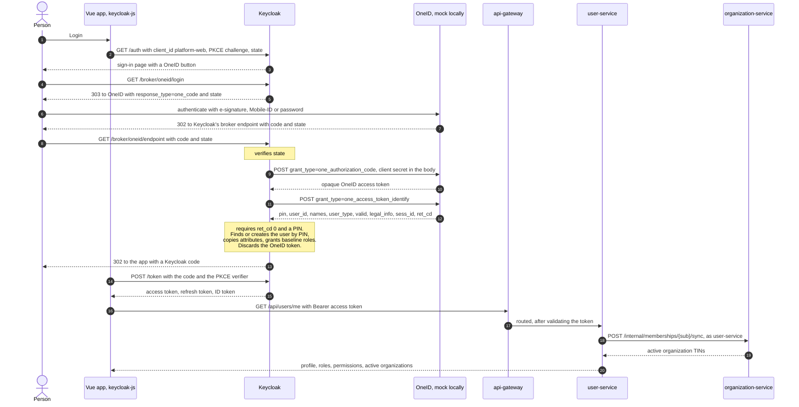
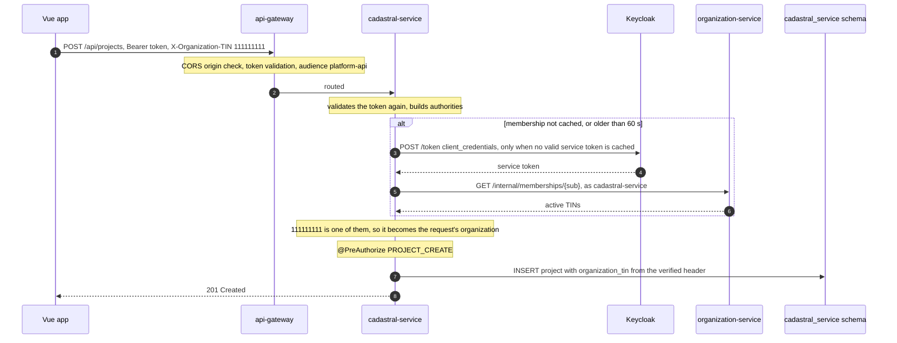
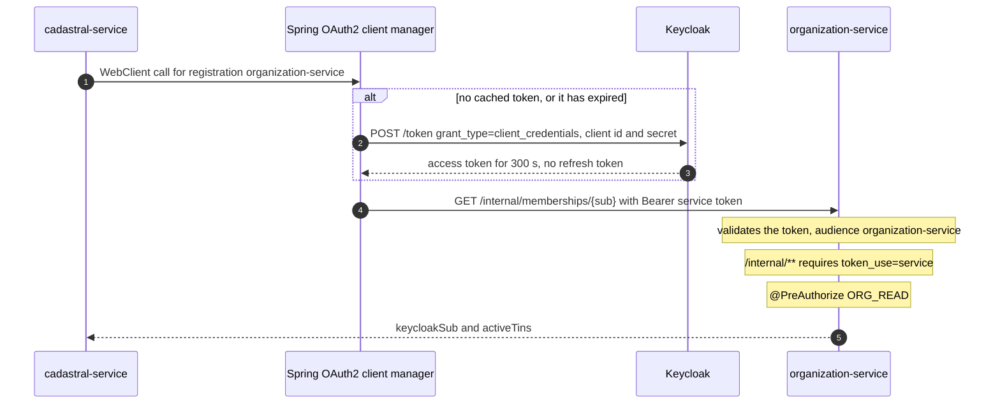
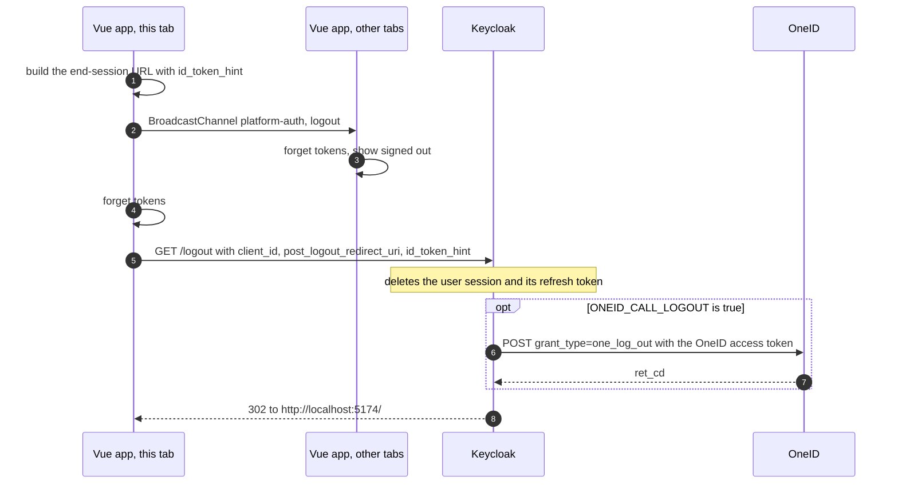

# Flows

How a login, a request, a service call and a logout actually move through the platform. The
recorded redirect chains, token claims and responses below were captured from the running Compose
stack; identifiers differ on every machine.

## Signing in with OneID



The redirect chain a browser follows, as recorded for `akarimov`:

```
200 http://localhost:8190/realms/platform/protocol/openid-connect/auth
303 http://localhost:8190/realms/platform/broker/oneid/login
200 http://localhost:8191/sso/oauth/Authorization.do        the person authenticates here
302 http://localhost:8191/sso/oauth/select
302 http://localhost:8190/realms/platform/broker/oneid/endpoint
->  http://localhost:5174/?code=...
```

Two short Keycloak steps, first-broker-login and after-first-broker-login, appear between the
endpoint and the app on a person's **first** login only. A returning person is recognised by their
PIN and goes straight back.

The authorization request Keycloak sends the browser to:

```
http://localhost:8191/sso/oauth/Authorization.do
  ?response_type=one_code
  &client_id=platform
  &redirect_uri=http://localhost:8190/realms/platform/broker/oneid/endpoint
  &scope=platform
  &state=<generated by Keycloak>
```

### Why OneID needs its own provider

OneID borrows OAuth2's shape and renames the parts Keycloak does not expose as settings:

| OneID | Standard OAuth2 / OIDC | Handled in `OneIdIdentityProvider` by |
|---|---|---|
| `response_type=one_code` | `response_type=code` | `createAuthorizationUrl` |
| `grant_type=one_authorization_code` | `grant_type=authorization_code` | `OneIdEndpoint.generateTokenRequest` |
| `grant_type=one_access_token_identify`, secret in the body | `GET /userinfo` with a Bearer header | `doGetFederatedIdentity` |
| `grant_type=one_log_out` | an end-session endpoint | `backchannelLogout`, `keycloakInitiatedBrowserLogout` |
| no `id_token` | always an `id_token` | nothing to verify |
| one URL for every operation | separate endpoints | the same URL in three settings |

Everything else is inherited from Keycloak's broker: generating and verifying `state`, the callback
endpoint, first-login detection, linking, sessions and token issuance.

### What OneID's answer becomes

| OneID field | In Keycloak | In the token |
|---|---|---|
| `pin` | the broker link, and attribute `oneid_pin` | never |
| `user_id` | username | `preferred_username` |
| `first_name`, `sur_name` | first and last name | `given_name`, `family_name`, `name` |
| `valid` | attribute `identity_verified` | `identity_verified` |
| `user_type` | attribute | `user_type` |
| `legal_info[].tin` | attribute `org_tins` | `org_tins` |
| `sess_id` | session note `oneid_sess_id` | never |
| legal entities, or `user_type` `L` | role `YURIDIK_SHAXS`; everyone gets `JISMONIY_SHAXS` | `realm_access.roles` |

A `ret_cd` other than `"0"`, or no PIN, fails the login with a generic message; the reason goes to
Keycloak's log. An account with `valid: false` still signs in. [Security](security.md) lists what
happens to every other field.

---

## The Keycloak token

Every API call carries Keycloak's access token. Decoded, for `akarimov` after a OneID login:

```json
{
  "iss": "http://localhost:8190/realms/platform",
  "aud": ["platform-api", "account"],
  "sub": "51346345-ff17-45f3-9426-7ca2aade0477",
  "azp": "platform-web",
  "sid": "6c811ff3-adce-4833-bd5d-40c202ee5dc5",
  "typ": "Bearer",
  "iat": 1789370253,
  "exp": 1789370553,
  "realm_access": {
    "roles": ["offline_access", "YURIDIK_SHAXS", "uma_authorization", "default-roles-platform", "JISMONIY_SHAXS"]
  },
  "resource_access": {
    "account": { "roles": ["manage-account", "manage-account-links", "view-profile"] }
  },
  "scope": "openid profile email",
  "token_use": "user",
  "user_type": "I",
  "identity_verified": true,
  "org_tins": ["111111111", "222222222"],
  "preferred_username": "akarimov",
  "name": "Ali Karimov",
  "given_name": "Ali",
  "family_name": "Karimov"
}
```

| Claim | Meaning | Used by |
|---|---|---|
| `iss` | Keycloak's public realm URL | every service requires exactly this |
| `aud` | who the token is for. `platform-api` is added for this app; `account` is Keycloak's own account console | every service requires one of its configured audiences |
| `exp` − `iat` | 300 seconds | every service; keycloak-js refreshes 30 seconds early |
| `sub` | the Keycloak user id | the identity key in every service's tables |
| `sid` | the Keycloak session | ended by logout |
| `realm_access.roles` | business roles, plus Keycloak's built-in defaults, which grant nothing here | converted to `ROLE_*`, then to permissions |
| `resource_access` | client roles; only a service's own entry counts in that service | `ORG_READ` and similar |
| `token_use` | `user`, set by a mapper on the `platform-web` client | tells people from services |
| `org_tins` | organizations OneID reported | membership reconciliation only |
| `identity_verified`, `user_type` | from OneID | profile; available to authorization |

There is no PIN and no OneID token anywhere in it. The **ID token** (`typ: ID`, `aud: platform-web`)
never goes to an API; keycloak-js keeps it only to send as `id_token_hint` at logout.

### How a service validates it

Without calling Keycloak, on every request:

1. Take the token from `Authorization: Bearer`.
2. Verify the RS256 signature with the realm's public key named by the token's `kid`. Keys are
   fetched once and cached.
3. Require `iss` to equal the configured issuer.
4. Require `exp` to be in the future, allowing 60 seconds of clock skew.
5. Require `aud` to contain one of the service's audiences.
6. Build authorities from roles, permissions, client roles and `token_use`.
7. Apply URL rules, the organization filter and `@PreAuthorize`. See
   [authorization](authorization.md#the-decision-chain).

---

## A person's request

Creating a project, `POST /api/projects` with `X-Organization-TIN: 111111111`:



The same request, refused at each step:

| What is wrong | Answer | How to tell |
|---|---|---|
| no token, or an invalid one | 401 | `WWW-Authenticate: Bearer`, with `error="invalid_token"` when a token was sent |
| a service token sent to the gateway | 401 | `error_description="... The aud claim is not valid"` |
| a TIN the person is not an active member of | 403 | body `{"error":"organization_membership_required", ...}` |
| the role grants no `PROJECT_CREATE` | 403 | `WWW-Authenticate: Bearer error="insufficient_scope"`, empty body |
| no `X-Organization-TIN` at all | 400 | |
| a project id belonging to another organization | 404 | |

---

## Service to service

cadastral-service asking organization-service whether a person belongs to an organization:



The service token, decoded:

```json
{
  "iss": "http://localhost:8190/realms/platform",
  "aud": "organization-service",
  "sub": "6adc858e-a82b-439a-a33c-5da1a23c802f",
  "azp": "cadastral-service",
  "preferred_username": "service-account-cadastral-service",
  "resource_access": { "organization-service": { "roles": ["ORG_READ"] } },
  "token_use": "service",
  "scope": "profile email"
}
```

No `realm_access`, so no business role, and certainly no `SUPER_ADMIN`. Its audience is only
`organization-service`, so the gateway and every other service refuse it. The token endpoint returns
no refresh token for client credentials, because a service simply asks again. Spring's
`AuthorizedClientServiceOAuth2AuthorizedClientManager` caches the token and renews it; nothing in the
platform hand-writes a token cache.

A person's token is never forwarded to another service. If it were, the called service would act
with the person's authority and receive a token addressed to someone else. It would also lose the
difference between "this person asked" and "this service asked", which is exactly the difference
that lets organization-service refuse people on `/internal/**`.

---

## Logout



Recorded:

```
302  GET  /realms/platform/protocol/openid-connect/logout?client_id=platform-web
          &post_logout_redirect_uri=http://localhost:5174/&id_token_hint=<ID token>
     Location: http://localhost:5174/

400  POST /realms/platform/protocol/openid-connect/token   grant_type=refresh_token, the old refresh token
     {"error":"invalid_grant","error_description":"Session not active"}
```

### What ends, and when

| What | Ends |
|---|---|
| the Keycloak session | at once, on the server |
| its refresh token | at once |
| tokens in the browser | at once, in every tab of the app |
| an access token already issued | at its expiry plus 60 seconds of clock skew, at most 6 minutes |
| the OneID session at sso.egov.uz | only with `ONEID_CALL_LOGOUT=true` |

Services validate tokens offline, so an access token copied before logout keeps working until it
expires. Keycloak itself knows at once: introspection reports it inactive, and userinfo refuses it.
Closing that window would take one of:

- **shorter access tokens.** The cheapest lever, and the first to pull.
- **the gateway introspecting every token.** That puts Keycloak on every request's path, and a call
  made straight to a service would still skip the check.
- **OIDC back-channel logout feeding a deny-list of session ids.** The list must be shared by every
  instance of every service, which means infrastructure such as Redis that this project avoids
  without a direct requirement.

None is implemented. The measurement, taken with 60-second tokens, is in the
[journal](implementation-journal.md), phase 11.

### OneID logout, `ONEID_CALL_LOGOUT`

- **Off, the default:** the OneID session at sso.egov.uz is left alone, so pressing Login again can
  sign the person straight back in without a credential prompt. That looks like a broken logout and
  is not.
- **On:** Keycloak keeps the OneID access token on each Keycloak session (in its database) because
  `one_log_out` needs it. The call is made once per logout, by the browser logout path and by an
  administrator ending a session. It never blocks the Keycloak logout if OneID is down, and it is
  not made when a session merely times out.

Whether `one_log_out` ends the whole OneID session or only revokes that token is undocumented.

### Logging out at OneID

Not synchronised. OneID documents no way to tell a relying party that a person logged out there, so
the Keycloak session carries on until it is logged out here or expires: 30 minutes idle, 10 hours
at most.
